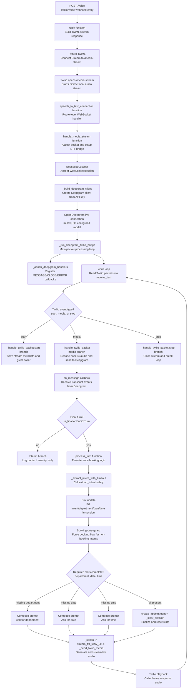

# Voice Call Execution Flowchart

This document describes the function execution order for customer calls.

## Main live call flow (/voice -> /media-stream)

## Function roles (quick reference)

1. reply(request): Twilio voice webhook entrypoint, returns TwiML that starts media streaming.
2. speech_to_text_connection(websocket): WebSocket route wrapper that calls the STT bridge.
3. handle_media_stream(websocket): Accepts WebSocket, opens Deepgram connection, starts runtime loop.
4. _run_deepgram_twilio_bridge(...): Core loop handling Twilio packet intake and stream lifecycle.
5. _attach_deepgram_handlers(...): Registers transcript and stream error/close callbacks.
6. _handle_twilio_packet(...): Handles start/media/stop packets and state updates.
7. process_turn(...): Booking conversation state machine for each final user utterance.
8. _extract_intent_with_timeout(...): Intent/entity extraction with timeout and fallback.
9. _speak(...): Converts response text to audio and sends it back to Twilio.
10. create_appointment(...): Creates final appointment once all required slots are available.